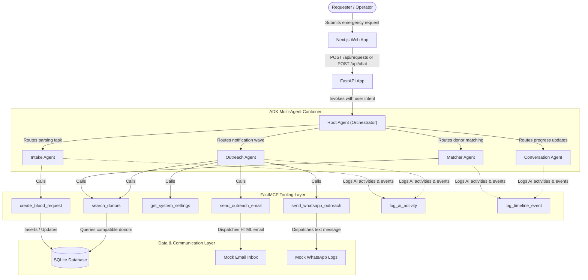
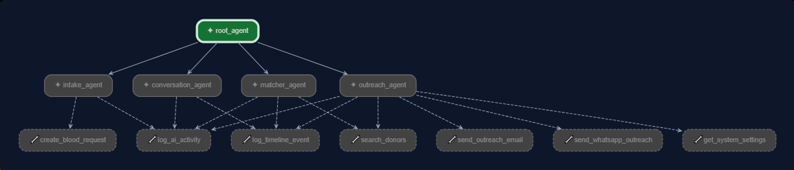
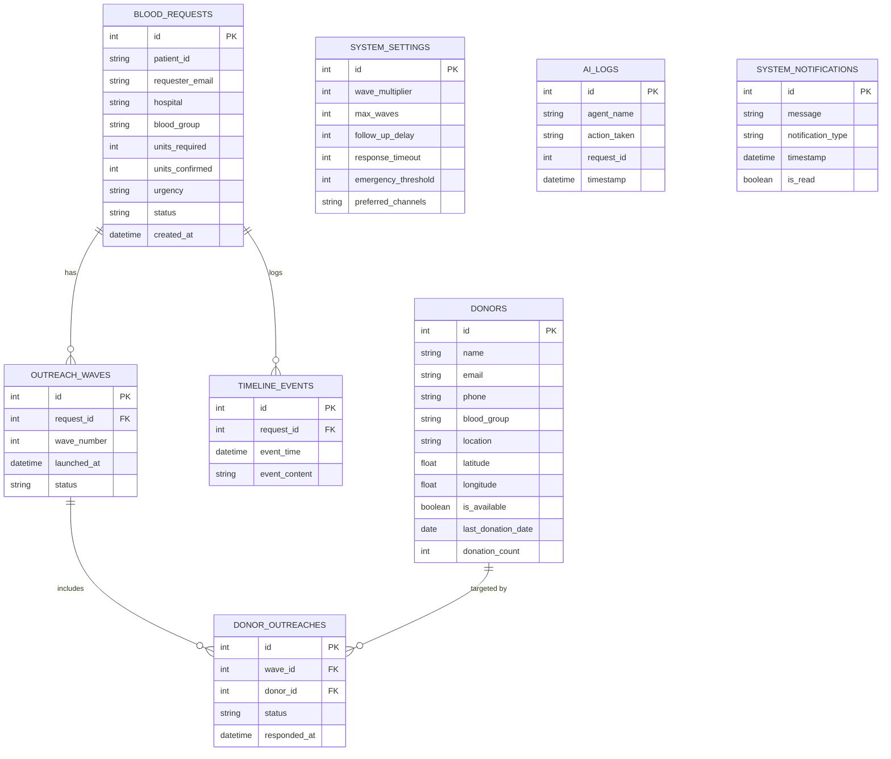

# 🩸 RedLine: AI-Driven Emergency Blood Donation Dispatcher

RedLine is an automated, AI-powered emergency blood donation coordination platform designed for the **Agents for Good** track of the Kaggle Vibe Coding Capstone Project. By leveraging a multi-agent system powered by **Google ADK** (Agent Development Kit) and an **MCP** (Model Context Protocol) tool layer, RedLine automates the entire emergency blood dispatch pipeline: from incoming request intake to donor matchmaking, wave-based communications, and post-donation verification.

---

## 1. Problem Statement

Emergency blood donation coordination is a critical, time-sensitive process where every minute can save a life. However, traditional coordination systems suffer from major structural issues:
- **High Friction & Slowness:** Medical staff or family members must manually search spreadsheet directories, call individual donors, and coordinate logistics.
- **Outreach Fatigue:** Contacting all donors at once leads to donor spam, confusion, and duplicate bookings.
- **Tracking Gaps:** Requesters are left in the dark about response status, and system operators have no real-time audit logs of who was contacted or when a donor accepted.
- **Verification Failures:** No automated follow-up exists to confirm if a donation actually took place, leading to unupdated donor records (e.g., ignoring the 90-day eligibility window).

---

## 2. Solution: RedLine AI Dispatcher

RedLine addresses these issues by replacing manual effort with a **collaborative multi-agent framework** that coordinates the emergency workflow:
1. **Automated Request Intake:** A natural language AI chat interface validates requirements (blood group, units, location, email, and urgency).
2. **Intelligent Matchmaking:** An agent searches the database to match donor groups and ranks them by geographical proximity (Haversine distance) and eligibility (excluding donors who donated in the last 90 days).
3. **Controlled Wave-Based Outreach:** Instead of spamming all compatible donors, the system launches staggered outreach waves (via simulated Email and WhatsApp), adjusting the contact pool based on system settings and urgency.
4. **Interactive Confirmation Loops:** Donors confirm or decline via interactive links, automatically updating the dashboard and email notifications to the requester.
5. **Post-Donation Audit & Verification:** The system automatically schedules a 24-hour follow-up to verify if the donation was completed, updating donor availability and historical counts.

---

## 3. System Architecture & Flows

The RedLine architecture separates the operational Next.js dashboard from the FastAPI backend, coordinating the agent workflow via Google ADK.

### High-Level Interaction Flow



---

## 4. Detailed Agent & Tool Design

RedLine utilizes a clean separation of concerns where agents reason and decide, and MCP tools perform read/write actions on the system state.

### ADK Agents (Defined in `backend/app/agents.py`)

- **`root_agent` (Orchestrator):** The primary entry point. It receives the user input and programmatically routes messages to specialized sub-agents based on the request state.
- **`intake_agent`:** Parses the natural language message context. If vital information (blood group, hospital, units, requester email) is missing, it asks follow-up questions. Once complete, it creates the request.
- **`matcher_agent`:** Triggered immediately after request creation. It calls matching tools to rank compatible donors in proximity to the hospital.
- **`outreach_agent`:** Evaluates system settings (e.g., wave multipliers) and coordinates wave-based outreach alerts. If the donor pool is exhausted without enough units, it escalates the request urgency to "Critical".
- **`conversation_agent`:** Keeps the requester and operators informed by summarizing agent actions and providing the request tracking ID.



### FastMCP Tools (Defined in `backend/app/mcp_server.py`)

- **`search_donors`:** Queries the SQLite database, checks blood group compatibility matrices (e.g., O- is universal donor), excludes donors unavailable or who donated within 90 days, computes Haversine distance, and returns sorted donor lists.
- **`create_blood_request`:** Inserts new blood requests, writes the initial timeline log, and triggers the first background outreach wave.
- **`send_outreach_email` / `send_whatsapp_outreach`:** Generates and dispatches HTML emails containing unique confirmation links, and simulates SMS/WhatsApp alerts.
- **`log_ai_activity` / `log_timeline_event`:** Records structured logs for operator auditing and renders live updates on the client UI.
- **`get_system_settings`:** Reads operator limits for wave scheduling (wave size multiplier, maximum waves, delays).

---

## 5. Database Schema

The SQLite database (`blood_donation.db`) tracks requests, donor status, outreach history, audit trails, and configuration details.



---

## 6. Setup & Installation Instructions

The system runs locally using a Python FastAPI backend and a Next.js frontend. The local SQLite database is pre-seeded with mock donor profiles situated in Karachi (e.g. Clifton, Gulshan-e-Iqbal, Indus Hospital, Saddar).

### Prerequisites
- **Python:** Version `3.11` or higher
- **Node.js:** Version `18` or higher
- **Package Managers:** `pip` / `uv` and `npm`

### Environment Configuration

Create a `.env` file inside the `backend/` directory:
```bash
# backend/.env
OPENROUTER_API_KEY="your-openrouter-api-key"
DATABASE_URL="sqlite:///./blood_donation.db"
```
*(Note: To test without OpenRouter, you can configure another model or LiteLLM provider in `backend/app/agents.py`)*

### Backend Installation

1. Open your terminal and navigate to the backend folder:
   ```powershell
   cd backend
   ```
2. Create and activate a Python virtual environment:
   ```powershell
   # On Windows (PowerShell)
   uv venv
   .venv\Scripts\Activate.ps1

   # On macOS/Linux
   uv venv
   source .venv/bin/activate
   ```
3. Install the dependencies:
   ```bash
   uv sync
   # OR
   uv pip install -r pyproject.toml
   ```
4. Start the FastAPI application:
   ```bash
   uv run main.py
   # OR
   uvicorn app.fast_api_app:app --reload --host 0.0.0.0 --port 8000
   ```
   *The backend documentation and Swagger UI will be available at `http://localhost:8000/docs`.*

### Frontend Installation

1. Open a new terminal and navigate to the frontend folder:
   ```bash
   cd frontend
   ```
2. Install the Node packages:
   ```bash
   npm install
   ```
3. Run the Next.js development server:
   ```bash
   npm run dev
   ```
4. Open your browser and navigate to:
   ```text
   http://localhost:3000
   ```

### Database Utilities
To completely wipe transactions (blood requests, waves, logs) and keep the database clean, run:
```bash
cd backend
python scripts/reset_db.py
```

---

## 7. Kaggle Course Concepts Mapping

The core concepts are implemented in the following modules:

| Rubric Concept | Implementation Location | Description |
| :--- | :--- | :--- |
| **Agent / Multi-Agent (ADK)** | [`backend/app/agents.py`](file:///d:/Tayyab/kaggle/blood-donation/backend/app/agents.py) | Defines `root_agent` orchestrating four sub-agents: `intake_agent`, `matcher_agent`, `outreach_agent`, and `conversation_agent`. |
| **MCP Server** | [`backend/app/mcp_server.py`](file:///d:/Tayyab/kaggle/blood-donation/backend/app/mcp_server.py) | Built using `mcp.server.fastmcp.FastMCP`, exposing tools for donor search, request creation, notifications, settings, and email/WhatsApp. |
| **Agent Skills (CLI & Eval)** | [`backend/GEMINI.md`](file:///d:/Tayyab/kaggle/blood-donation/backend/GEMINI.md) & [`backend/tests/`](file:///d:/Tayyab/kaggle/blood-donation/backend/tests) | Evaluates prompt configurations using `agents-cli playground` and standard test assertions using `pytest`. |
| **Simulated Deployability** | [`backend/app/fast_api_app.py`](file:///d:/Tayyab/kaggle/blood-donation/backend/app/fast_api_app.py) | Provides a mock email inbox and WhatsApp viewer routes, allowing judges to test confirmation callbacks and SMS notifications locally without API keys. |
| **Security Features** | [`backend/app/fast_api_app.py`](file:///d:/Tayyab/kaggle/blood-donation/backend/app/fast_api_app.py) | Restricts API keys to environmental configurations (`.env`) and separates public-facing inputs from internal database parameters. |